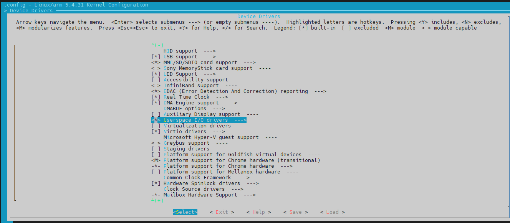

# lab笔记

## Chapter5

### Lab5_2

```
mount -t nfs -o nolock,vers=3 192.168.5.11:/home/book/nfs_rootfs /mnt
```

```
把里面的"cc"全部修改为"arm-buildroot-linux-gnueabihf-gcc"
```

设备树

```
	ledRGB {
		compatible = "arrow,RGBleds";
		clocks = <&rcc GPIOA>,
			 <&rcc GPIOG>;

		clock-names = "GPIOA", "GPIOG";

		green {
			label = "ledgreen";
		};

		yellow {
			label = "ledyellow";
		};
	};
```


lab5_2.ko演示

```
[root@100ask:~/lab/chapter5/lab5_2]# insmod lab5_2.ko
[ 2815.327668] led_probe enter
[ 2815.330143] RGBleds ledRGB: there are 2 nodes
[ 2815.334005] the led number 0 is registered
[ 2815.337893] the led number 1 is registered
[ 2815.345224] leds_probe exit
[root@100ask:~/lab/chapter5/lab5_2]# ls /dev/led*
/dev/ledgreen   /dev/ledyellow
[root@100ask:~/lab/chapter5/lab5_2]# echo on > /dev/ledgreen
[ 2924.249747] led_write() is called.
[ 2924.251701] This message is received from User Space: on
[ 2924.257023] led_write() is exit.
[root@100ask:~/lab/chapter5/lab5_2]# echo off > /dev/ledgreen
[ 2939.809552] led_write() is called.
[ 2939.811507] This message is received from User Space: off
[ 2939.816983] led_write() is exit.
[root@100ask:~/lab/chapter5/lab5_2]# echo on > /dev/ledyellow
[ 2956.310186] led_write() is called.
[ 2956.312141] This message is received from User Space: on
[ 2956.317557] led_write() is exit.
[root@100ask:~/lab/chapter5/lab5_2]# echo off > /dev/ledyellow
[ 2966.609563] led_write() is called.
[ 2966.611519] This message is received from User Space: off
[ 2966.616927] led_write() is exit.
[root@100ask:~/lab/chapter5/lab5_2]# cat /dev/ledgreen
[ 3007.320408] the size of the message is 3
off
[root@100ask:~/lab/chapter5/lab5_2]# cat /dev/ledyellow
[ 3019.161541] the size of the message is 3
off
[root@100ask:~/lab/chapter5/lab5_2]# rmmod lab5_2.ko
[ 3032.458997] leds_remove enter
[ 3032.461029] the led number 0 is unregistered
[ 3032.465312] the led number 1 is unregistered
[ 3032.471510] leds_remove exit
```


### Lab5_3

设备树

```
	ledclassRGB {
		compatible = "arrow,RGBclassleds";
		reg = <0x50002000 0x400>,
		      <0x50008000 0x400>;
		
		clocks = <&rcc GPIOA>,
			 <&rcc GPIOG>;

		clock-names = "GPIOA", "GPIOG";

		green {
			label = "ledgreen";
		};

		yellow {
			label = "ledyellow";
		};
	};
```


编译设备树

```
book@100ask:~/100ask_stm32mp157_pro-sdk/Linux-5.4$ make dtbs
  DTC     arch/arm/boot/dts/stm32mp157c-100ask-512d-lcd-v1.dtb
  DTC     arch/arm/boot/dts/100ask-stm32mp157c-pro-lcd.dtb
```


拷贝设备树到网络文件系统

```
cp arch/arm/boot/dts/stm32mp157c-100ask-512d-lcd-v1.dtb ~/nfs_rootfs/
```


```
cd /home/book/100ask_stm32mp157_pro-sdk/linux_5.4_stm32mp1_drivers/lab/chapter5/lab5_3

book@100ask:~/100ask_stm32mp157_pro-sdk/linux_5.4_stm32mp1_drivers/lab/chapter5/lab5_3$ make

mkdir ~/nfs_rootfs/lab/chapter5/lab5_3/
cp lab5_3.ko ~/nfs_rootfs/lab/chapter5/lab5_3/
```


```
cp /mnt/stm32mp157c-100ask-512d-lcd-v1.dtb /boot
mkdir ~/lab/chapter5/lab5_3
cp /mnt/lab/chapter5/lab5_3/* ~/lab/chapter5/lab5_3/
```


```

[root@100ask:~/lab/chapter5/lab5_3]# insmod lab5_3.ko
[   49.939803] lab5_3: module verification failed: signature and/or required key missing - tainting kernel
[   49.948947] RGBclassleds 50002000.ledclassRGB: platform_probe enter
[   49.957621] RGBclassleds 50002000.ledclassRGB: r->start = 0x50002000
[   49.963435] RGBclassleds 50002000.ledclassRGB: r->end = 0x500023ff
[   49.968868] RGBclassleds 50002000.ledclassRGB: r->start = 0x50008000
[   49.975356] RGBclassleds 50002000.ledclassRGB: r->end = 0x500083ff
[   49.981615] RGBclassleds 50002000.ledclassRGB: there are 2 nodes
[   49.988006] RGBclassleds 50002000.ledclassRGB: platform_probe exit
[root@100ask:~/lab/chapter5/lab5_3]# ls /sys/class/leds/
ledgreen   ledyellow
[root@100ask:~/lab/chapter5/lab5_3]# cd /sys/class/leds/
[root@100ask:/sys/class/leds]# ls
ledgreen   ledyellow
[root@100ask:/sys/class/leds]# cd ledgreen
[root@100ask:/sys/class/leds/ledgreen]# ls
brightness      device          invert          max_brightness  power           subsystem       trigger         uevent
[root@100ask:/sys/class/leds/ledgreen]# echo 0 > brightness
[root@100ask:/sys/class/leds/ledgreen]# echo 1 > brightness
[root@100ask:/sys/class/leds/ledgreen]# cd ..
[root@100ask:/sys/class/leds]# cd ledyellow
[root@100ask:/sys/class/leds/ledyellow]# echo 1 > brightness
[root@100ask:/sys/class/leds/ledyellow]# echo 0 > brightness
[root@100ask:/sys/class/leds/ledyellow]# cd ..
[root@100ask:/sys/class/leds]# cd ledgreen
[root@100ask:/sys/class/leds/ledgreen]# ls
brightness      device          max_brightness  power           subsystem       trigger         uevent
[root@100ask:/sys/class/leds/ledgreen]# echo timer > trigger
[root@100ask:/sys/class/leds/ledgreen]# rmmod lab5_3.ko
[  322.031507] RGBclassleds 50002000.ledclassRGB: platform_remove enter
[  322.036444] RGBclassleds 50002000.ledclassRGB: platform_remove exit
[root@100ask:/sys/class/leds/ledgreen]#

```


### Lab5_4

打开UIO模块




```
	UIO {
		compatible = "arrow,UIO";
		reg = <0x50002000 0x1000>;
		clocks = <&rcc GPIOA>;		
	};
```


```
mkdir ~/nfs_rootfs/lab/chapter5/lab5_4/
cp lab5_4.ko ~/nfs_rootfs/lab/chapter5/lab5_4/
```


```
mkdir ~/lab/chapter5/lab5_4
cp /mnt/lab/chapter5/lab5_4/* ~/lab/chapter5/lab5_4/
```


查看内核中的模块

```
cat /proc/kallsyms | grep uio
```


编译

```
mkdir ~/nfs_rootfs/lab/chapter5/lab5_4/
cp lab5_4.ko lab5_4_test ~/nfs_rootfs/lab/chapter5/lab5_4/

mkdir ~/lab/chapter5/lab5_4
cp /mnt/lab/chapter5/lab5_4/* ~/lab/chapter5/lab5_4/
```

